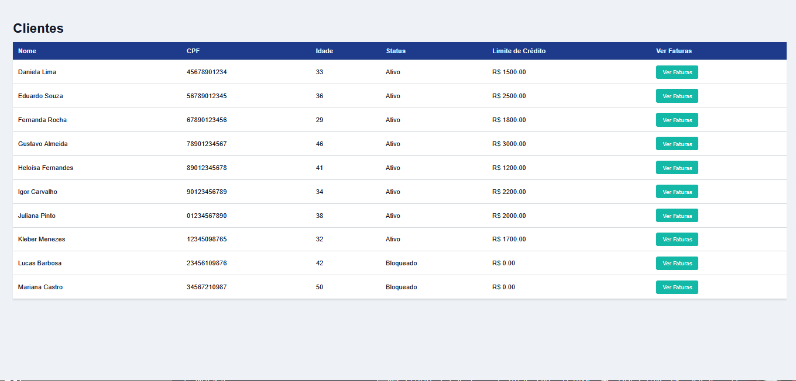
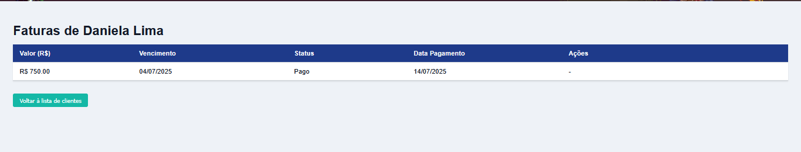

# DesafioTecnico-RPE-Front

## Desafio Técnico RPE - Frontend

Este é o projeto Frontend do desafio técnico para a EVOLUIR (fintech RPE), desenvolvido com foco em uma aplicação simples para gerenciar **clientes** e suas **faturas**.

---

### Tecnologias utilizadas

* HTML5
* CSS3 (vanilla)
* JavaScript (ES6+)
* Fetch API para chamadas HTTP
* Vite / VS Code (para desenvolvimento local)
* Spring Boot (no backend, consumido via API REST)

---

### Funcionalidades do Frontend

#### 📋 Lista de Clientes

* Exibe nome, CPF, idade calculada, status (Ativo ou Bloqueado) e limite de crédito.
* Botão "Ver Faturas" para cada cliente, que redireciona para a tela de faturas.

#### 💰 Tela de Faturas

* Mostra todas as faturas de um cliente específico.
* Converte status da fatura:

  * `B` → "Aberto"
  * `A` → "Atrasado"
  * `P` → "Pago"
* Permite registrar pagamento de faturas não pagas.
* Botão para voltar para a lista de clientes.

---


### Como rodar o projeto local

1. Clone o repositório:

```bash
git clone https://github.com/JohnHerbert1/DesafioTecnico-RPE-Front.git
cd DesafioTecnico-RPE-Front
```

2. Abra o projeto no **VS Code**.

3. Inicie o backend Spring Boot em `localhost:8080`.

4. Abra o `index.html` no navegador (por exemplo usando `Live Server` do VS Code ou servindo com o `vite` ou `http-server`).

---

### Observações

* O frontend consome a API REST do backend Spring Boot.
* Por padrão, o backend precisa estar rodando em `http://localhost:8080`.
* CORS já está habilitado no backend para `http://127.0.0.1:5500`.

---

### Telas do projeto

#### 🧑‍💼 Lista de Clientes

#### 🧾 Faturas do Cliente

---
